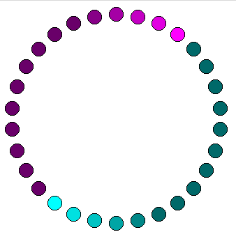

# NeoPixel simulator for Python

This provides a `NeoPixel` and `NeoPixelRing` classes that are
API-compatible with the [MicroPython][] [`neopixel` module][neopixel].

The `NeoPixel` class creates a horizontal array of LEDs, while the
`NeoPixelRing` class creates a ring.

## Requirements

This requires the `tkinter` module.

[micropython]: https://micropython.org
[neopixel]: https://docs.micropython.org/en/latest/esp8266/tutorial/neopixel.html
